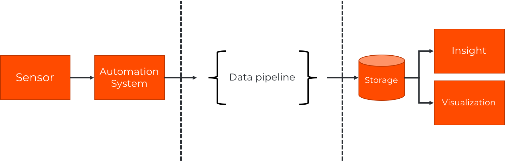
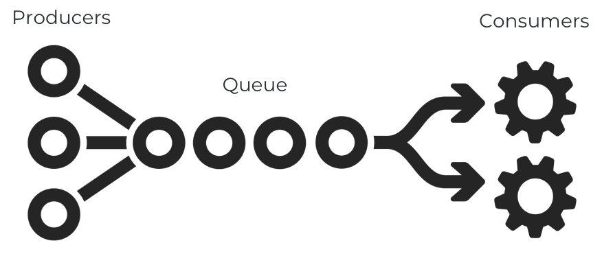
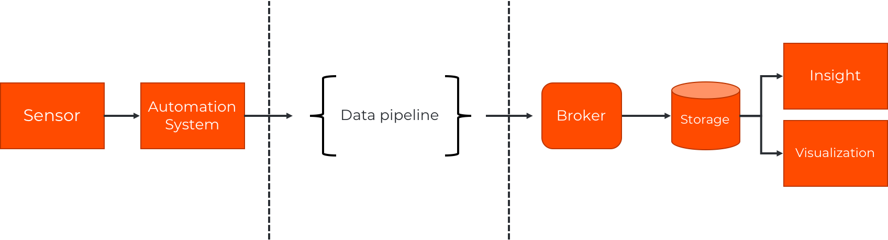
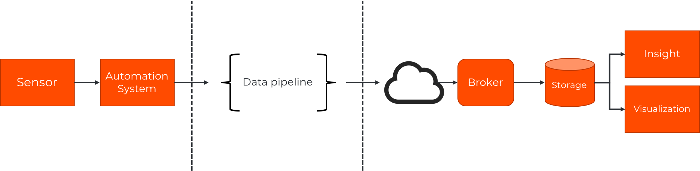

The overall architecture is built for flexibility and to be able to capture multiple
different scenarios.

The basics of it is that one needs to capture time series data from a source and be
able to work with this data throughout a data pipeline and then store this in order
to be able to do insight on top of it and maybe some visualization.

Dolittle TimeSeries does not implement its own storage mechanism, nor is it locked
to a specific one. But rather depending on an event broker to be able to route and
distribute the data to a desired storage mechanism.

The event broker is typically exposing standard endpoints such as [MQTT](https://en.wikipedia.org/wiki/MQTT) or
[AMQP](https://en.wikipedia.org/wiki/Advanced_Message_Queuing_Protocol). Modern brokers
today typically support the notion of a stream and adheres to the
[Competing Consumer Pattern](https://docs.microsoft.com/en-us/azure/architecture/patterns/competing-consumers).
Enabling us to have an arbitrary number of multiple concurrent processors of any events/messages being
published and without the publisher needing to take this into consideration.

This gives a better approach than a regular publish / subscribe message and creates for
more decoupled software.

An important aspect of the overall architecture is our commitment to being an
[edge native](/edge). With this in hand, we design everything to work
not only in a homogenous environment like the cloud, but also making it
edge first in terms of making the actual data pipelines run anywhere and
we can then connect it back to the cloud or any data-center.

